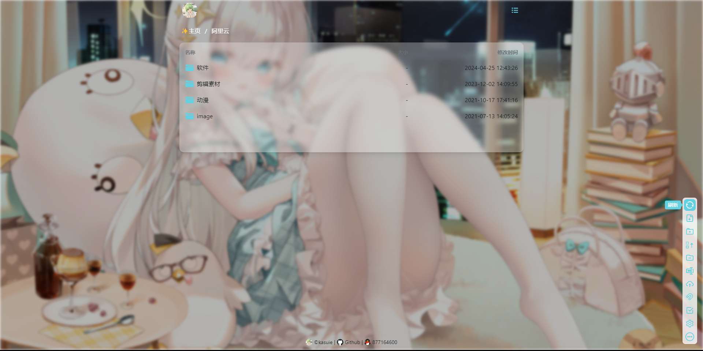
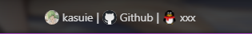

<!--
 * @Author: kasuie
 * @Date: 2023-05-08 22:52:57
 * @LastEditors: kasuie
 * @LastEditTime: 2024-05-07 11:03:47
 * @Description:
-->

# alist-customize

alist 样式上的一些调整美化，都是一些主观调整的调整，如恰巧你也喜欢那便是极好的了~

alist style adjustments and beautifications, all subjective adjustments. If by chance you also like them, that would be great~

- 主题扩展轻松自定义
- 主观上的一些美化，包含整体半透明，随机背景图片
- 自定义footer

## 使用

自定义有两部分，一部分在`css`文件里，一部分在`js`文件里，互相没有关系，可以单独使用。

单独使用`css`效果：


加上`js`效果：


亮色主题效果：



登录页：


- `index.css`: 样式的一些调整，内置主题色为`rgb(100, 209, 226)` #64d1e2 偏蓝, 如需要修改其他颜色，修改文件内的变量即可。修改 `--mio-primary`, `--mio-primary50` 这个两个变量一般就能满足情况，注意请使用 rgb 通道值，例如你想改成一个偏粉的主题，修改如下就好了：
```css
    --mio-primary: 237, 105, 176;
    --mio-primary50: 190, 100, 166;
```

`alist`管理后台自定义头部引入：

```js
<link href="https://cdn.jsdelivr.net/gh/kasuie/alist-customize@main/v3/css/index.min.css" rel="stylesheet" type="text/css" />
```

- `index.js`： 主要是一些对页面 Dom 元素的操作和样式调整，目前支持自定义页面下方的`footer`，需要在`alist`后台管理自定义内容中添加一段描述 footer 的文本，`js`自动加载渲染到页面，例如：

```js
<div id="footer-data" style="display: none;">
    [
        {"url": "https://kasuie.cc", "text": "kasuie", "icon": 1, "target": "_blank"},
        {"url": "https://github.com", "text": "Github", "icon": 0, "target": "_blank"},
        {"url": "xxx", "text": "xxx"}
    ]
<div>

<script src="https://cdn.jsdelivr.net/gh/kasuie/alist-customize@main/v3/js/index.min.js"></script>
```

以上就会生成三个 a 标签放置在底部：

其中数组对象参数:

- `url`: 字符串，必填，代表 a 标签的跳转链接
- `text`: 字符串，必填，a 标签的文本内容
- `icon`: 数字，非必填，是否展示链接的 icon
- `target`: 字符串，非必填，a 标签的 target 属性

根据自己需要调整数组里的对象，其他地方保持不变即可，当然你不需要自定义这部分，也可以仅仅引入 css 文件就好。

如果你的站点加载`cdn.jsdelivr.net`速度不理想，可以考虑使用其他cdn替代，例如：

```javascript
<link href="https://jsd.cdn.zzko.cn/gh/kasuie/alist-customize@main/v3/css/index.min.css" rel="stylesheet" type="text/css" />
<script src="https://jsd.cdn.zzko.cn/gh/kasuie/alist-customize@main/v3/js/index.min.js"></script>
```

## ~省流~

`css` 自定义头部处引入：

```js
<link href="https://cdn.jsdelivr.net/gh/kasuie/alist-customize@main/v3/css/index.min.css" rel="stylesheet" type="text/css" />
```

`js` 自定义内容处引入：

```js
<div id="footer-data" style="display: none;">
    [
        {/* 根据自己需要，参照上方示例填写 */}
    ]
<div>

<script src="https://cdn.jsdelivr.net/gh/kasuie/alist-customize@main/v3/js/index.min.js"></script>
```