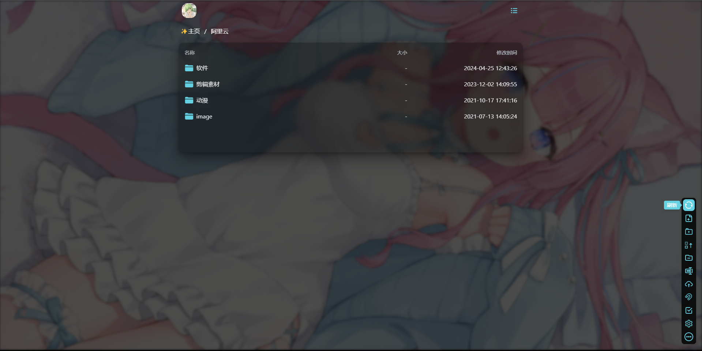
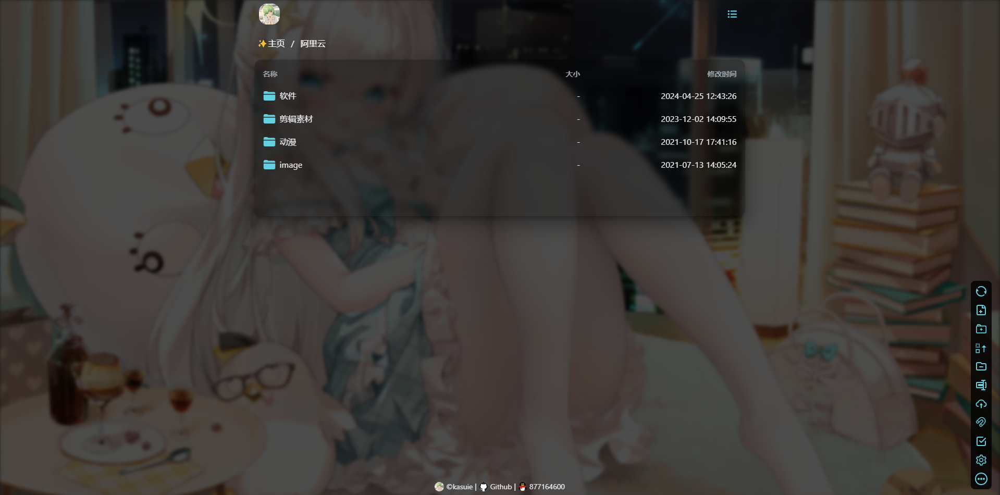

<!--
 * @Author: kasuie
 * @Date: 2023-05-08 22:52:57
 * @LastEditors: kasuie
 * @LastEditTime: 2024-04-25 22:20:42
 * @Description:
-->

# alist-customize

> alist(v3) 样式上的一些调整美化，都是迎合自己的审美做的调整

## 使用

自定义有两部分，一部分在`css`文件里，一部分在`js`文件里，互相没有关系，可以单独使用。

单独使用`css`效果：


加上`js`效果：


- `index.css`: 样式的一些调整，内置主题色为`rgb(100, 209, 226)`, 如需要修改其他颜色，修改文件内的变量即可：

  > 修改 `--mio-primary`, `--mio-primary50` 这个两个变量一般就能满足情况，使用 rgb 通道值

`alist`管理后台自定义头部引入：

```js
<link href="https://cdn.jsdelivr.net/gh/kasuie/alist-customize@v1.0.1/v3/css/index.min.css" rel="stylesheet" type="text/css" />
```

- `index.js`： 主要是一些对页面 Dom 元素的操作和样式调整，目前支持自定义页面下方的`footer`，需要在 alist 后台管理自定义内容中添加一段描述 footer 的文本，`js`自动加载渲染到页面，例如：

```js
<div id="footer-data" style="display: none;">
[
  {"url": "https://kasuie.cc", "text": "kasuie", "icon": 1, "target": "_blank"},
  {"url": "https://github.com", "text": "Github", "icon": 0, "target": "_blank"},
  {"url": "xxx", "text": "xxx"}
]
<div>

<script src="https://cdn.jsdelivr.net/gh/kasuie/alist-customize@v1.0.1/v3/js/index.min.js"></script>
```

以上就会生成三个 a 标签放置在底部：

其中数组对象参数:

- `url`: 字符串，必填，代表 a 标签的跳转链接
- `text`: 字符串，必填，a 标签的文本内容
- `icon`: 数字，非必填，是否展示链接的 icon
- `target`: 字符串，非必填，a 标签的 target 属性

根据自己需要调整数组里的对象，其他地方保持不变即可，当然你不需要自定义，也可以仅仅引入 css 文件就好。
